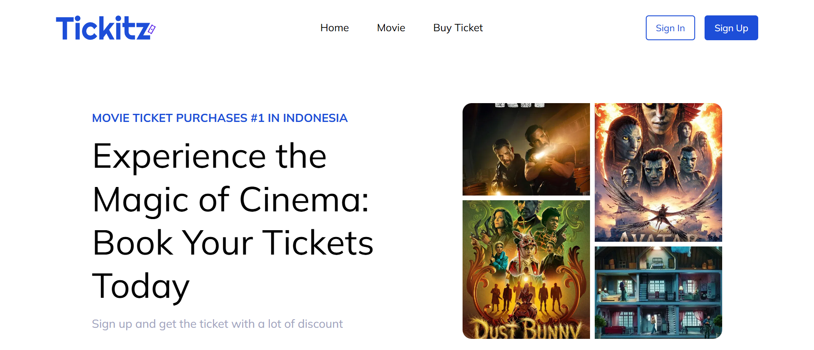

# Tickitz Frontend

Tickitz adalah aplikasi web modern untuk pemesanan tiket bioskop secara online. Aplikasi ini dirancang untuk memberikan pengalaman pengguna yang mulus dalam mencari film, memilih jadwal, menentukan kursi, hingga melakukan pembayaran secara real-time.

## Teknologi yang Digunakan

Aplikasi ini dibangun menggunakan stack teknologi modern untuk performa dan skalabilitas:

| Komponen | Teknologi |
| --- | --- |
| **Frontend Framework** | [React 19](https://react.dev/) |
| **Build Tool** | [Vite](https://vitejs.dev/) |
| **State Management** | [Redux Toolkit](https://redux-toolkit.js.org/) |
| **Styling** | [Tailwind CSS v4](https://tailwindcss.com/) |
| **Routing** | [React Router v7](https://reactrouter.com/) |

## Fitur Utama

- **Pencarian Film**: Cari film yang sedang tayang (Now Showing) atau yang akan datang (Upcoming).
- **Detail Film**: Informasi lengkap mengenai sinopsis, genre, durasi, dan cast.
- **Booking**:
  - Filter jadwal film berdasarkan lokasi, tanggal, dan nama bioskop.
  - Kursi interaktif (termasuk tipe Love Nest).
  - Ringkasan pesanan sebelum pembayaran.
- **Sistem Pembayaran**: Integrasi metode pembayaran populer (GoPay, Dana, Bank Transfer).
- **Profil Pengguna**: Manajemen informasi akun dan histori pemesanan tiket.
- **Dashboard Admin**: (Khusus Admin) Kelola data film dan pantau statistik penjualan.
- **Responsive Design**: Tampilan yang dioptimalkan untuk perangkat mobile dan desktop.

## Tampilan Aplikasi


## Instruksi Instalasi & Penggunaan

### 1. Prasyarat
- [Node.js](https://nodejs.org/) (versi 18.x atau terbaru)
- npm

### 2. Setup Environment Variable
Buat file `.env` di direktori root frontend dan sesuaikan nilainya:

```env
# URL base untuk API Backend
VITE_DB_BASE_URL=http://localhost:5000

# Jika Menggunakan TMDB Integration
VITE_TMDB_BASE_URL=https://api.themoviedb.org/3
VITE_TMDB_IMAGE_BASE=https://image.tmdb.org/t/p/w500
VITE_TMDB_TOKEN=your_tmdb_token_here
```

### 3. Instalasi Dependensi
Jalankan perintah berikut:
```bash
npm install
```

### 4. Menjalankan Aplikasi
Untuk mode pengembangan (development):
```bash
npm run dev
```
Aplikasi akan berjalan di `http://localhost:5173` secara default.

### 5. Membangun untuk Produksi
```bash
npm run build
```

## Informasi Tambahan

- **Struktur Proyek**:
  - `src/components`: Komponen UI yang reusable.
  - `src/pages`: Halaman utama aplikasi.
  - `src/redux`: Logika state management dan thunks.
  - `src/assets`: Gambar, logo, dan file statis lainnya.
- **Hot Reload**: Menggunakan fitur HMR dari Vite untuk pengembangan yang cepat.

## Lisensi

Proyek ini dilisensikan di bawah [MIT License](LICENSE).

## Project Terkait

- **Backend**: [Tickitz Backend (Go)](https://github.com/Albaihaqi354/Tickitz-BE)
